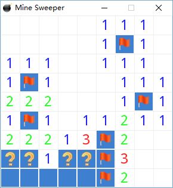
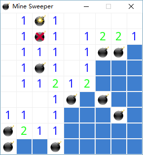
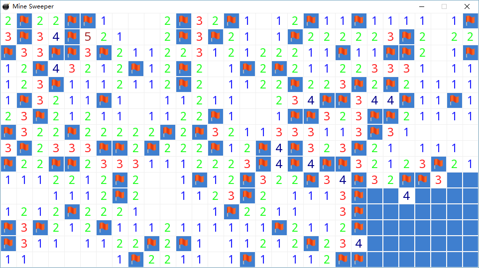

# Mine Sweeper

 This is a classical game called "Mine Sweeper" (or "扫雷" in Chinese) implemented with C and [SDL 2](http://www.libsdl.org).

## Screenshots







## How to build

### Requirement
 * CMake 3.5+
 * C compiler and toolchain

 Because SDL is designed to be cross-platform, any modern OS with suitable build tools should be able to build and run this project.

### Setup

 1. Download **Development Libraries** from [SDL 2 download page](https://www.libsdl.org/download-2.0.php) or install them from the package manager of your OS.
 2. Download other **Development Libraries** for the following SDL plugins or install them from the package manager of your OS.
    1. [SDL2_image](https://www.libsdl.org/projects/SDL_image/) for loading and rendering various formats of images
    2. [SDL2_ttf](https://www.libsdl.org/projects/SDL_ttf/) for loading and rendering TTF fonts
    3. [SDL2_mixer](https://www.libsdl.org/projects/SDL_mixer/) for loading and playing music and sounds
 3. If you download these files manually, you should modify `CMakeLists.txt` to correct the paths of library files. If you are using a package manager, probably you don't need to change this, because the libraries will be installed globally.

### Build

 1. Use CMake to generate a build system

 ```bash
 mkdir build
 cd build
 cmake -G "MinGW Makefiles" ..
 ```

 Here I use the "MinGW Makefiles" generator in CMake because I have mingw32 installed on my Windows 10, but you may use other generators (or the default one for your OS) if you have setup corresponding libraries correctly.

 2. Build it

 You may use CMake to build it

 ```bash
 cmake --build .
 ```

 or directly use the corresponding build tools for the generated build system, e.g. (for mingw32)

 ```bash
 mingw32-make
 ```

## How to run

 Run it through double-click or command line.

### Parameters

 If you run it through command line, you may specify customized initialization parameters for this game:

  argument   | meaning        | example 
 :---:|:--------------:|:-------:
 1    |map width       |16      
 2    |map height      |16       
 3    |number of mines |40       

 e.g.

 ```bash
 MineSweeper.exe 16 16 40
 ```

 The classical parameter settings are:

  Difficulty  | map width | map height | number of mines 
 :-----------:|:---------:|:----------:|:---------------:
 Easy         |9          |9           |10               
 Intermediate |16         |16          |40               
 Hard         |30         |16          |99               

 The default parameters are adopted from the "Easy" difficulty and will be used when no customized parameters are given (e.g. when you double-click it).

## Tests

### Platform support

 - [ ] Windows 10 (32 bit) + MinGW 32
 - [x] Windows 10 (64 bit) + MinGW 32
 - [ ] Windows 10 (32 bit) + Visual Studio 2015
 - [x] Windows 10 (64 bit) + Visual Studio 2015
 - [ ] Ubuntu 14.04 (32 bit)
 - [x] Ubuntu 14.04 (64 bit)
 - [ ] Mac OS X 10.11
 - [ ] Android 4.2
 - [ ] iOS 9.3

Only ticked platforms are tested, but technically all platforms listed above should be able to support this game.
